## 第一次实验：无人值守安装ubuntu

### 实验过程

- 设置host-only网卡开机自启动，自动获取ip地址

  - 开启dhcp

    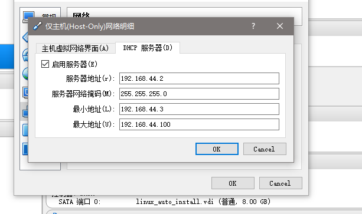

  - 更改网络设置

    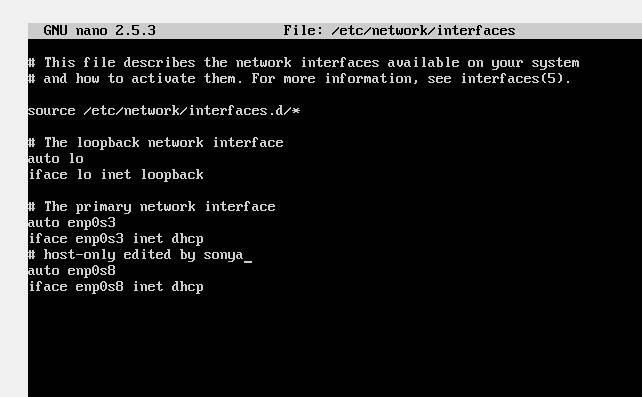

  - 结果

    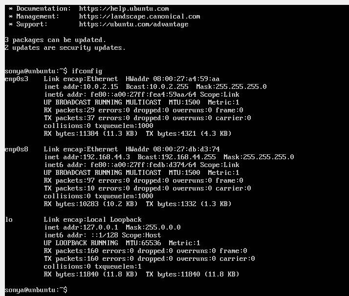

- 自定义镜像实现自动安装

  - 打开镜像文件所在目录

    ```bash
    rsync -av loopdir/ cd
    # rsync: 数据镜像备份工具
    # -av : 
    ##     a 归档模式，表示以递归方式传输文件，并保持所有文件属性
    ##     v:详细模式输出
    ```

  - 更改镜像文件中isolinux/txt.cfg文件：在文件中添加如图圈出部分（**注意添加的位置**）

    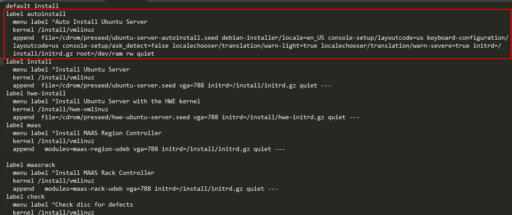

  - 将preseed文件添加到镜像文件preseed目录下

    - 使用psctf将本地文件上传到linux工作环境
    - 注意命名，保持一致。依据txt.cfg中的设置，preseed文件应命名为：ubuntu-server-autoinstall.seed

  - 更改镜像文件中的md5sum.txt文件（md5sum不能操作文件夹）

    ```shell
    # 权限问题
    sudo -s
    cd ~/cd && find . -type f -print0 | xargs -0 md5sum > md5sum.txt
    # ~/cd 是镜像文件所在目录
    # xargs : xargs是给命令传递参数的一个过滤器,也是组合多个命令的一个工具。它把一个数据流分割为一些足够小的块,以方便过滤器和命令进行处理。
    #       -0：当sdtin含有特殊字元时候,将其当成一般字符
    #find :用来在指定目录下查找文件
    #   	.： 当前目录其子目录下所有文件和文件夹
    #       -type  f: 查找普通类型的文档
    #       -print0 :假设find指令的回传值为Ture，就将文件或目录名称列出到标准输出。格式为全部的名称皆在同一行；
    ```

  - 重新做成iso文件（利用mkisofs）

    ```shell
    IMAGE=custom.iso
    BUILD=~/cd/

    mkisofs -r -V "Custom Ubuntu Install CD" \
                -cache-inodes \
                -J -l -b isolinux/isolinux.bin \
                -c isolinux/boot.cat -no-emul-boot \
                -boot-load-size 4 -boot-info-table \
                -o $IMAGE $BUILD
    ```

- 测试更改：成功自启动

  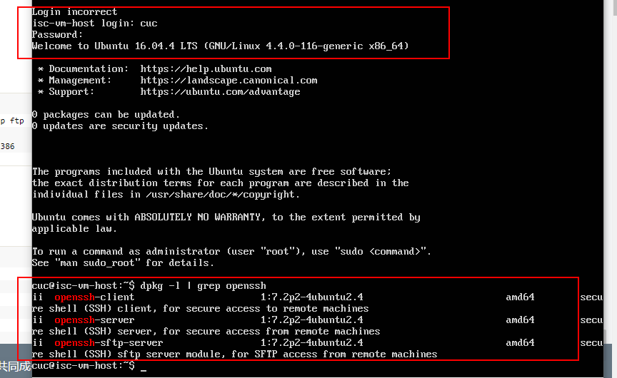

### 实验问题

- 对比老师制作的seed文件和示例文件的不同

  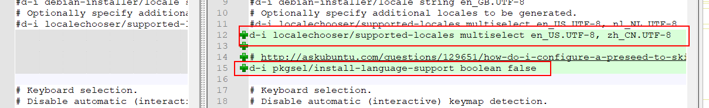

  - 选择支持的地点
  - 跳过语言支持询问

  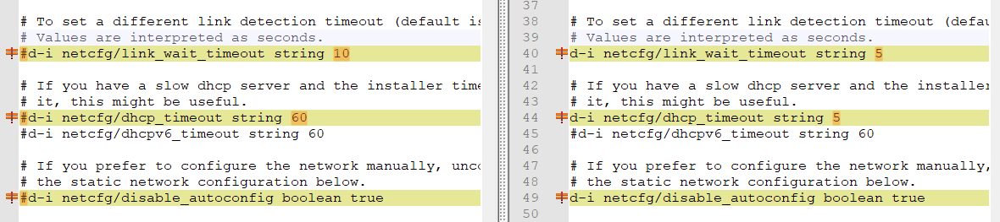

  - 修改链接等待时间
  - 修改dhcp服务等待时间
  - 开启网络手动设置

  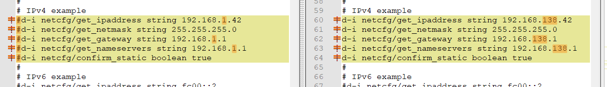

  - 静态设置网卡，包括ip地址，网络掩码，网关，名称服务器地址

  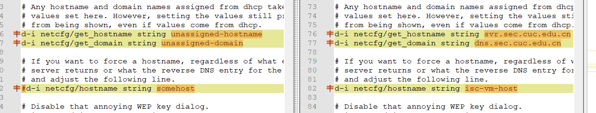

  - 设置默认主机名，域名。如果有dhcp分配的域名和主机名，直接覆盖。
  - 设置强制主机名，isc-vm-host，不可覆盖。

  

  - 设置一般用户  用户名 cuc 密码 sec.cuc.edu.cn

  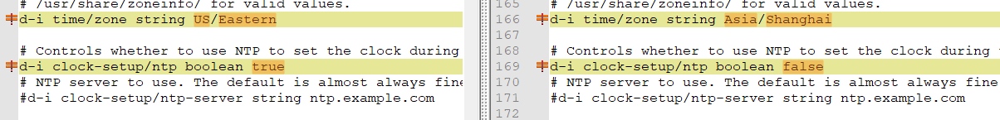

  - 设置时区
  -  安装期间，不使用NTP设置时间

  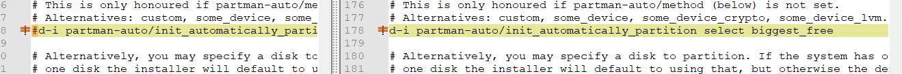

  - 选取最大的空闲空间进行自动分区

  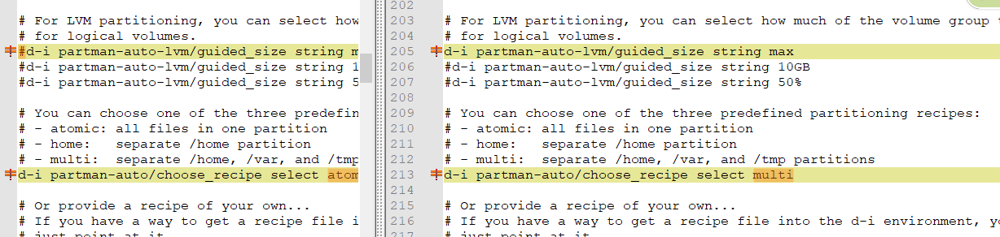

  - 对于LVM分区方法，选择尽可能多的卷组用于逻辑卷
  - 选择分区目录：/home /var/ tmp分离的分区

  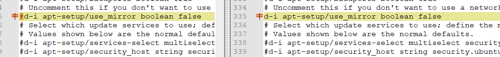

  - 不使用网络镜像

  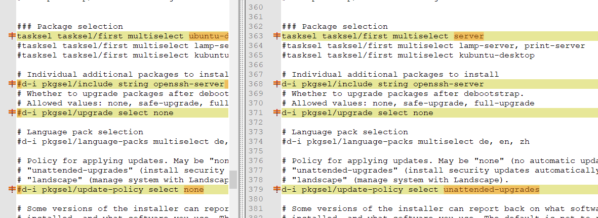

  - server版的安装包
  - 预安装openssh-server
  - 在debootstrap之后不更新安装包
  - 自动安装安全更新

- Virtualbox安装完Ubuntu之后新添加的网卡如何实现系统开机自动启用和自动获取IP？

  - 如实验报告开始处所示

- 如何使用sftp在虚拟机和宿主机之间传输文件？

  - 使用psftp

    ```shell
    open <ip-address-VM> #连接到虚拟机
    get <filename>       #从虚拟机下载文件到宿主机
    put <filename>       #从宿主机上传文件到虚拟机
    ```

    ​