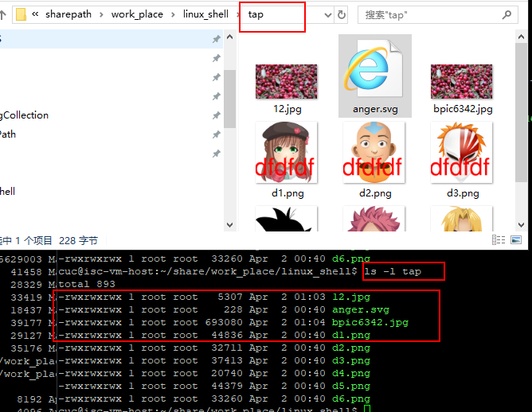
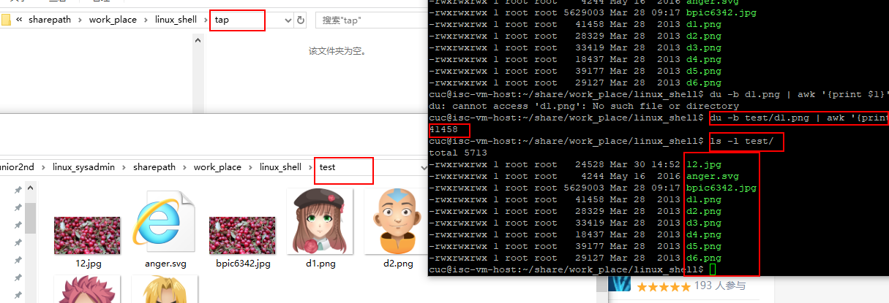
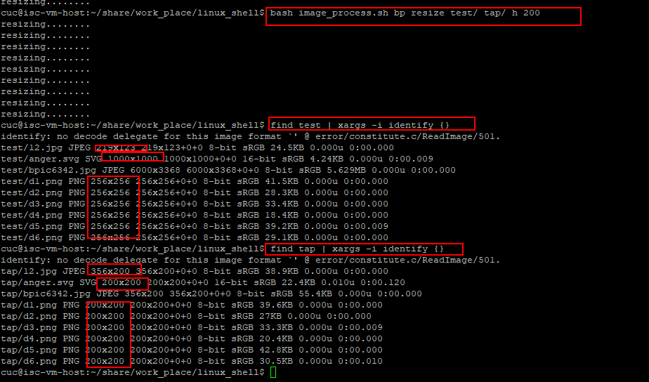
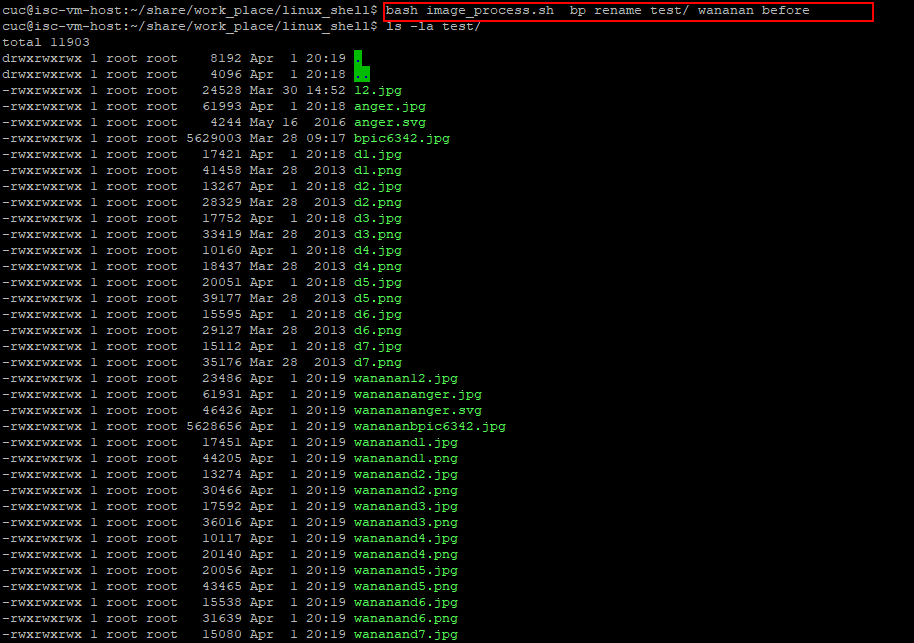
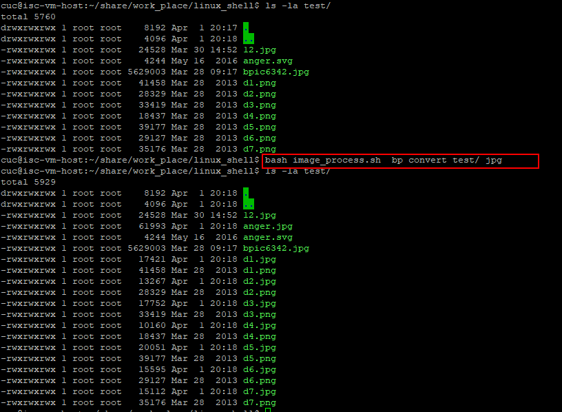
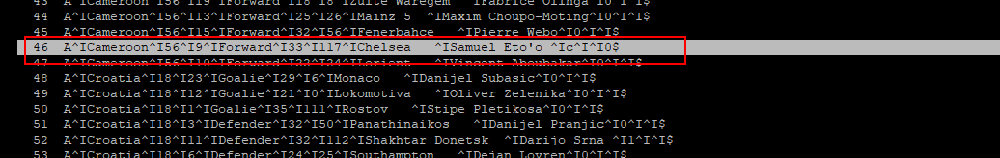
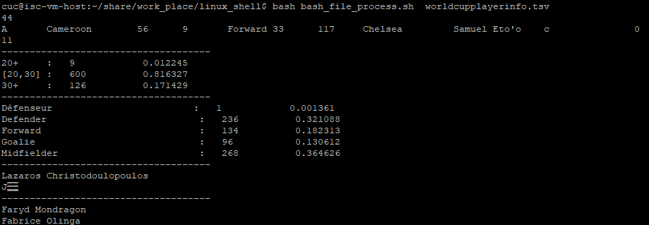
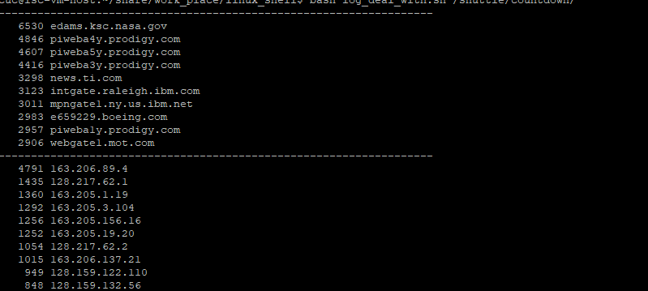
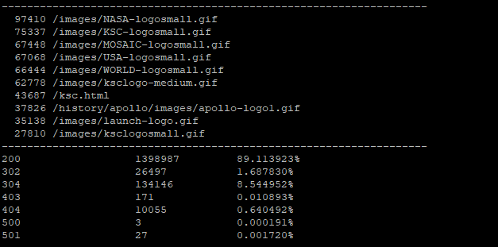
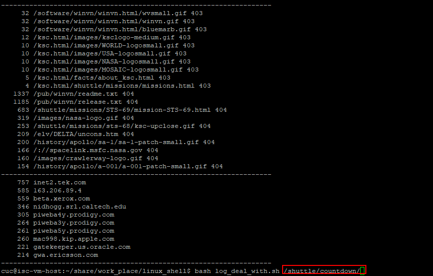

## shell编程

### 任务一：用bash编写一个图片批处理脚本，实现以下功能：

- 支持命令行参数方式使用不同功能

  - 帮助

    

- 支持对指定目录下所有支持格式的图片文件进行批处理

- 支持以下常见图片批处理功能的单独使用或组合使用

  - 支持对jpeg格式图片进行图片质量压缩

    - 组合添加水印命令一起使用的举例

      - 开始前

      

      - 命令

        ```bash
        bash image_process.sh np :bp add_text test/ tap/ dfdfdf 100 red southeast 10,10:bp compress test/ tap/ 20
        ```

      - 结果：

        

        因为两张JPEG图片在执行第二个指令（压缩）时覆盖了文件 所以没有水印

  - 支持对jpeg/png/svg格式图片在保持原始宽高比的前提下压缩分辨率

    - 将test/ 文件压缩到高为200 并保存在tap/目录

      

  - 支持对图片批量添加自定义文本水印

    - 已验证

  - 支持批量重命名（统一添加文件名前缀或后缀，不影响原始文件扩展名）

    

  - 支持将png/svg图片统一转换为jpg格式图片



### 任务二：用bash编写一个文本批处理脚本，对附件分别进行批量处理完成相应的数据统计任务

- 有一条脏数据



- 结果依次如下



### 任务二：用bash编写一个文本批处理脚本，对附件分别进行批量处理完成相应的数据统计任务

- Web服务器访问日志

- 统计访问来源主机TOP 100和分别对应出现的总次数

- 统计访问来源主机TOP 100 IP和分别对应出现的总次数

  - 只显示了前10条

  

- 统计最频繁被访问的URL TOP 100

- 统计不同响应状态码的出现次数和对应百分比

  

- 分别统计不同4XX状态码对应的TOP 10 URL和对应出现的总次数

- 给定URL输出TOP 100访问来源主机

  - 查询的URL为/shuttle/countdown

  


## 问题

- 遇见了不可见字符\001编码问题（SOH character ）

  参考链接：https://stackoverflow.com/questions/22339368/how-to-remove-octal-character-using-linux