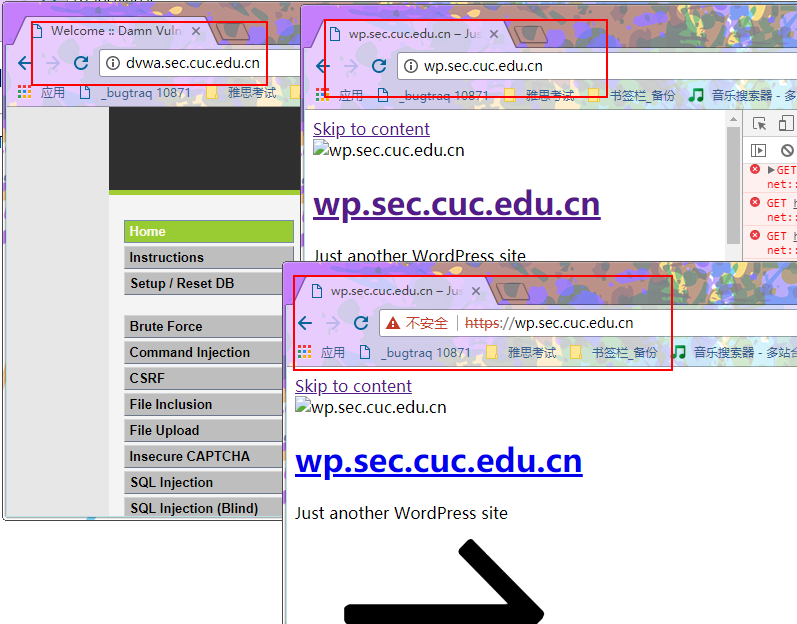
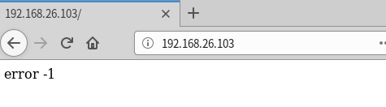
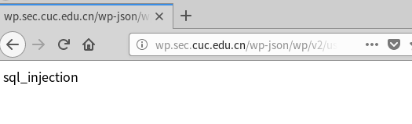
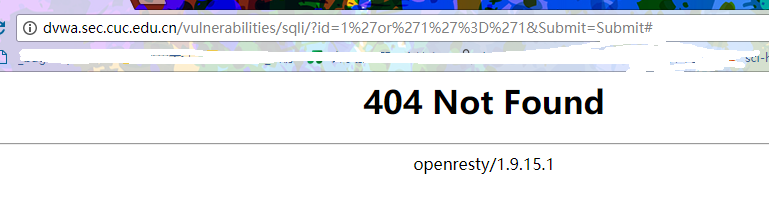
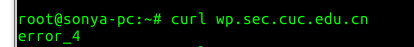
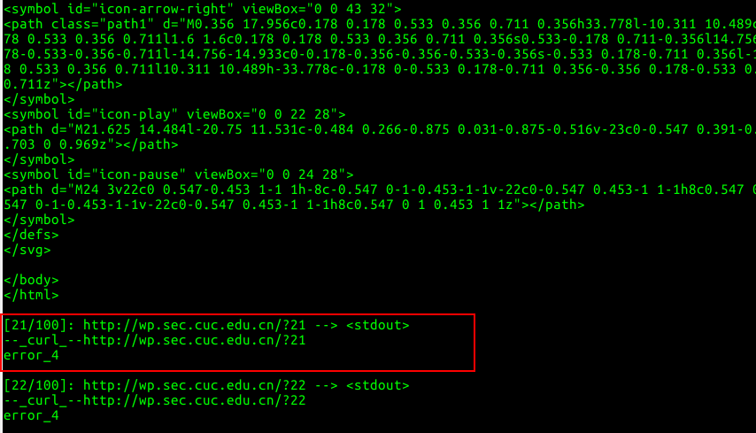
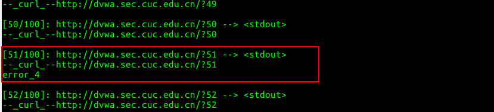

## web服务器

### 基本要求

- wordpress 

  - 参考链接：
    - 安装wordpress:https://www.digitalocean.com/community/tutorials/how-to-install-wordpress-with-lamp-on-ubuntu-16-04
    - 配置https:https://www.digitalocean.com/community/tutorials/how-to-create-a-self-signed-ssl-certificate-for-nginx-in-ubuntu-16-04

- DVWA

- verynignx

  - 配置反向代理

    - 更改nginx监听端口 8081:wordpress 8082:dvwa
    - 设置matcher 以及 proxy_pass

    ```json
     "proxy_pass_rule":[{
          "enable":true,
          "matcher":"wordpress", //Host=wp.sec.cuc.edu.cn
          "upstream":"wordpress",
          "proxy_host":"wp.sec.cuc.edu.cn"
        },{
          "enable":true,
          "matcher":"dvwa",//Host=sec.sec.cuc.edu.cn
          "upstream":"dvwa",
          "proxy_host":"dvwa.sec.cuc.edu.cn"
        }],

    "backend_upstream":{
        "dvwa":{
          "node":{
            "dvwa":{
              "host":"192.168.26.103",//wp所在服务器地址
              "weight":"100",
              "scheme":"http",
              "port":"8082"
            }
          },
          "method":"random"
        },
        "wordpress":{
          "node":{
            "wordpress":{
              "host":"192.168.26.103",
              "weight":"100",
              "scheme":"http",
              "port":"8081"
            }
          },
          "method":"random"
        }

    ```

    ​

    ​			

- 效果验证

  ​	

### 安全加固要求

- 使用IP地址方式均无法访问上述任意站点，并向访客展示自定义的**友好错误提示信息页面-1**

  - 设置文件

  ```json
  //matcher 
  "ip_host":{
        "Host":{
          "value":"^\\d+\\.\\d+.\\d+.\\d+$",
          "operator":"≈"
        }
      },
  ```

  ```json
  // filter_rule
        "enable":true,
        "code":"404",
        "response":"No_ip_host_visit",
        "matcher":"ip_host",
        "custom_response":true,
        "action":"block"
  ```

  - 效果

    

- [Damn Vulnerable Web Application (DVWA)](http://www.dvwa.co.uk/)只允许白名单上的访客来源IP，其他来源的IP访问均向访客展示自定义的**友好错误提示信息页面-2**

  - 配置

    ```json
    //matcher
    "ip_dvwa":{
          "Host":{
            "value":"dvwa.sec.cuc.edu.cn",
            "operator":"="
          },
          "IP":{
            "value":"192.168.26.102",
            "operator":"!="
          }
        },
    ```

    ​

    ```json
     // filter_rule
     	"enable":true,
          "code":"404",
          "response":"No_strange_ip_visit",
          "action":"block",
          "custom_response":true,
          "matcher":"ip_dvwa"
    ```

  - 效果

    

    ​

- 在不升级Wordpress版本的情况下，通过定制[VeryNginx](https://github.com/alexazhou/VeryNginx)的访问控制策略规则，**热**修复[WordPress < 4.7.1 - Username Enumeration](https://www.exploit-db.com/exploits/41497/)

  - 经过阅读代码漏洞是通过访问特地文件读到了用户数据，所以只要禁止访问特定目录就达到了修复目的

  - 设置

    ```json
    //matcher
        "sql_match":{
          "URI":{
            "value":"/wp-json/wp/v2/users/",
            "operator":"≈"
          },
          "Host":{
            "value":"wp.sec.cuc.edu.cn",
            "operator":"≈"
          }
        },

    ```

    ​

    ```json
    //filter_rule
     	"enable":true,
          "code":"404",
          "response":"sql_wordpress",
          "action":"block",
          "custom_response":true,
          "matcher":"sql_match"

    ```

  - 效果

    

    ​

    ​

- 通过配置[VeryNginx](https://github.com/alexazhou/VeryNginx)的Filter规则实现对[Damn Vulnerable Web Application (DVWA)](http://www.dvwa.co.uk/)的SQL注入实验在低安全等级条件下进行防护

  - 通过阅读源代码 低安全等级下的数据库访问是直接通过字符串拼接访问语句实现的，所以只要禁止相关关键字即可实现防护目标

  - 设置

    ```json
    //matcher
    	"sql_dvwa":{
          "Host":{
            "value":"dvwa.sec.cuc.edu.cn",
            "operator":"≈"
          },
          "Args":{
            "operator":"≈",
            "name_operator":"*",
            "value":".+and|or|%27.+"
          }
        },

    ```

    ```json
    //filter_rule
    	"enable":true,
          "code":"404",
          "matcher":"sql_dvwa",
          "custom_response":false,
          "action":"block"
        }],

    ```

  - 效果

    

### VERYNGINX配置要求

- [VeryNginx](https://github.com/alexazhou/VeryNginx)的Web管理页面仅允许白名单上的访客来源IP，其他来源的IP访问均向访客展示自定义的**友好错误提示信息页面-3**

  - 因为禁止了IP访问，而verynginx没有设置域名，所以在原有设置下vernginx也是不能被除本机外（端口转发）访问的其他主机访问
  - 添加了类似dvwa的设置

- VeryNginx

  - 限制DVWA站点的单IP访问速率为每秒请求数 < 50

  - 限制Wordpress站点的单IP访问速率为每秒请求数 < 20

  - 超过访问频率限制的请求直接返回自定义**错误提示信息页面-4**

  - 禁止curl访问

    ```json
    // 要求1，2，3 
    "frequency_limit_rule":[{
          "enable":true,
          "code":"404",
          "response":"error_4",
          "matcher":"dvwa",
          "count":"50",
          "time":"1",
          "custom_response":true,
          "separate":["ip"]
        },{
          "enable":true,
          "code":"200",
          "response":"error_4",
          "matcher":"wordpress",
          "count":"20",
          "time":"1",
          "custom_response":true,
          "separate":["ip"]
        }],
    //要求4的matcher
        "curl_request":{
          "UserAgent":{
            "value":"curl",
            "operator":"≈"
          }
        },

    ```

  - 效果

    - 命令

    ```bash
    curl http://www.myurl.com/?[1-50]
    ```

    - 禁止curl访问

    

    - 允许curl访问 测试wordpress 

    

    - 允许curl访问 测试dvwa

    

    ​
    ​


