## SHELL脚本编程练习进阶（实验）

### 一、FTP

注：所有任务都已完成

请自行根据以下任务需求从以上FTP服务器软件中选择一款满足所有任务要求的FTP服务器进行安装配置实验

- 选择proftpd
  -  原因：https://systembash.com/evaluating-ftp-servers-proftpd-vs-pureftpd-vs-vsftpd/
  -  配置文件位置：/etc/proftpd/proftpd.conf（没有具体写文件地址的更改都发生在这个文件里）

-  配置一个提供匿名访问的FTP服务器，匿名访问者可以访问1个目录且仅拥有该目录及其所有子目录的只读访问权限

  - 配置

  ```bash
  # 将配置文件中的匿名模块的注释去掉
  <Anonymous /home/ftp>
  User                            sonya
  Group                           sonya
  UserAlias                      anonymous sonya
  RequireValidShell              off
  <Directory *>
       <Limit WRITE>
         DenyAll
      </Limit>
     </Directory>
  </Anonymous>
  ```
  - 效果

    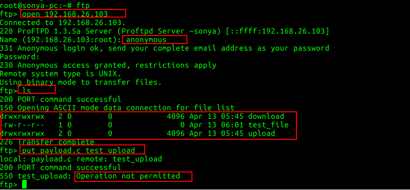

- 配置一个支持用户名和密码方式访问的账号，该账号继承匿名访问者所有权限，且拥有对另1个独立目录及其子目录完整读写（包括创建目录、修改文件、删除文件等）权限；

  - 该账号仅可用于FTP服务访问，不能用于系统shell登录；

  - 配置文件修改

    ```bash
    #AuthOrder              mod_auth_file.c mod_auth_pam.c* mod_auth_unix.c 一定不要像这样配置
    AuthOrder               mod_auth_file.c  mod_auth_unix.c
    #同时支持匿名用户和帐号密码方式登录
    AuthUserFile /etc/proftpd/ftpd.passwd
    AuthUserFile /etc/proftpd/ftpd.group
    ```

  - 添加用户

    ```bash
    ftpasswd --passwd --file=/etc/proftpd/ftpd.passwd --name=ftp_another --uid=1000 --home=/home/ftp_other --shell=/sbin/nologin
    #添加虚拟用户 uid=1000(用户sonya的uid) 目录为/home/ftp_other 以sonya的身份写入  同时禁止系统shell登录
    ftpasswd --group --file=/etc/proftpd/ftpd.group --name=ftp_group --gid=1000
    #添加用户组
    ftpasswd --group --name=ftp_group --gid=99 --member=ftp_another
    #将用户添加如用户组
    ```

  - 效果

    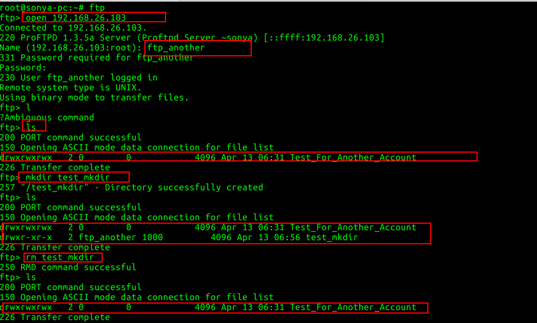

- FTP用户不能越权访问指定目录之外的任意其他目录和文件

  ```bash
  DefaultRoot                     ~
  ```

- 匿名访问权限仅限白名单IP来源用户访问，禁止白名单IP以外的访问；

  - 配置

  ```bash
  #Anonymous模块内加入
  <Limit LOGIN /home/ftp/*>
  Order allow,deny
  Allow from 192.168.26.102
  Deny from all
  </Limit>
  ```

- （可选加分任务）使用FTPS服务代替FTP服务，上述所有要求在FTPS服务中同时得到满足；

  - 配置

    ```bash
    Include /etc/proftpd/tls.conf
    ```

  - tls.conf

    ```bash
    <IfModule mod_tls.c>
    TLSEngine                  on
    TLSLog                     /var/log/proftpd/tls.log
    TLSCipherSuite AES128+EECDH:AES128+EDH
    TLSOptions                 NoCertRequest AllowClientRenegotiations
    TLSRSACertificateFile      /etc/proftpd/ssl/proftpd.cert.pem
    TLSRSACertificateKeyFile   /etc/proftpd/ssl/proftpd.key.pem
    TLSVerifyClient            off
    TLSRequired                on
    RequireValidShell          no
    </IfModule>
    ```

  - 生成证书

    ```ssh
    openssl req -new -x509 -days 365 -nodes -out /etc/proftpd/ssl/proftpd.cert.pem -keyout /etc/proftpd/ssl/proftpd.key.pem
    ```

  - 效果

    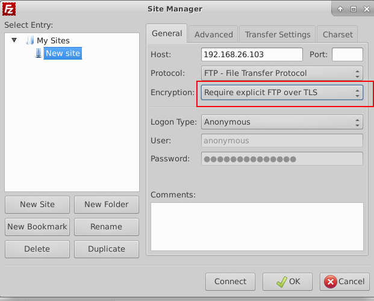

    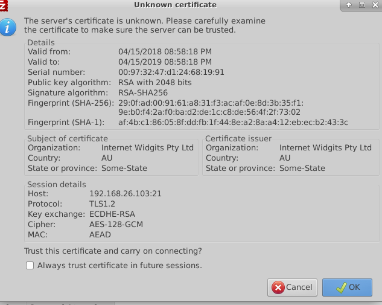

    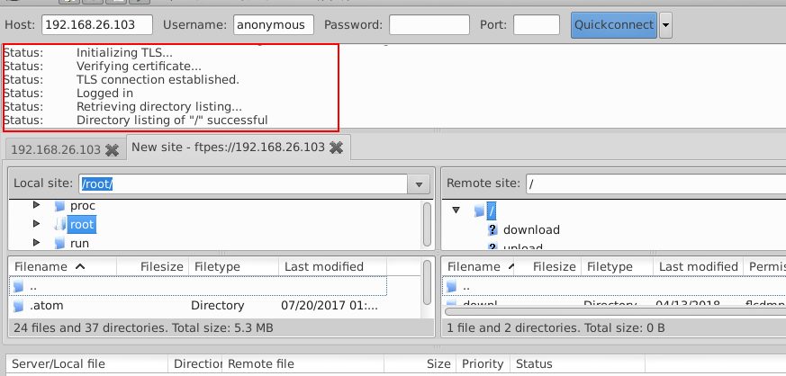

### 二、NFS

- 在1台Linux上配置NFS服务，另1台电脑上配置NFS客户端挂载2个权限不同的共享目录，分别对应只读访问和读写访问权限；

  - 服务器

    ```bash
    sudo apt install nfs-kernel-server
    # nfs-kernel-server 服务名 
    ```

  - 客户端

    ```bash
    sudo apt install nfs-common
    ```

  - 可读可写目录

    - 创建目录、更改/etc/exports文件、重启服务（下同）

    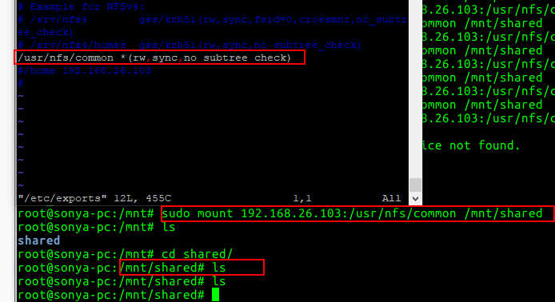

  - 只读目录

    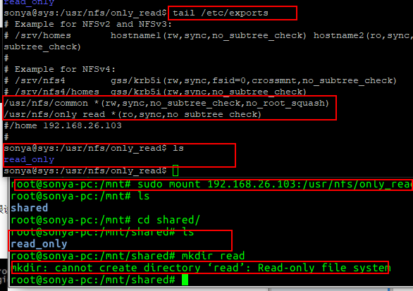

  - 参考链接：https://www.tutorialspoint.com/articles/how-to-set-up-and-configure-nfs-on-ubuntu-16-04

- 实验报告中请记录你在NFS客户端上看到的（以下演示在可读可写目录下进行）

  - 共享目录中文件、子目录的属主、权限信息

  - 你通过NFS客户端在NFS共享目录中新建的目录、创建的文件的属主、权限信息

    - 依照默认设置(root_squash) 创建文件属主nobody(nogroup)
    - 服务器文件：test_sync 客户端创建文件：test_from_client

    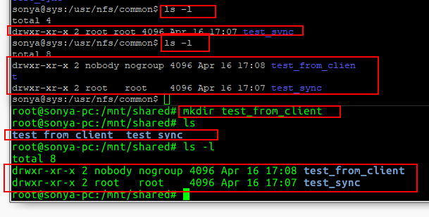

  - 上述共享目录中文件、子目录的属主、权限信息和在NFS服务器端上查看到的信息一样

    吗？无论是否一致，请给出你查到的资料是如何讲解NFS目录中的属主和属主组信息应该如何正确解读

    - 属主信息一致无论是客户端、服务器都是nobody
    - 但是再测试时不能再创建文件了 所以在原有设置上增加了 no_root_squash
      - 即本地以root用户执行创建文件、创建的文件属主不管是server还是client都是root用户。

    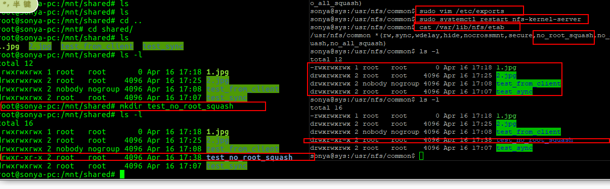吗？无论是否一致，请给出你查到的资料是如何讲解NFS目录中的属主和属主组信息应该如何正确解读

- （可选加分任务）在客户端或NFS服务器上抓包分析使用NFS协议时的远程文件下载、上传、移动、删除等操作是否是明文？远程的文件传输数据流是否可以被恢复出完整的传输文件？
  - 提示：我们在《网络安全》第4章《网络监听》中介绍过的工具filesnarf

  - 明文

    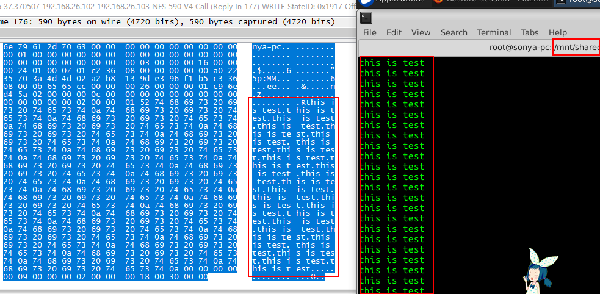

### 三、DHCP

2台虚拟机使用Internal网络模式连接，其中一台虚拟机上配置DHCP服务，另一台服务器作为DHCP客户端，从该DHCP服务器获取网络地址配置

- 服务器

  - 参考链接：https://www.ostechnix.com/install-dhcp-server-in-ubuntu-16-04/

  - 设置静态ip

    ```
    auto enp0s9
    iface enp0s9 inet static
    address 10.5.5.3
    netmask 255.255.255.0
    gateway 10.5.5.3
    ```

  - 安装

    ```bash
    sudo apt-get install isc-dhcp-server
    ```

  - 配置

    ```bash
    sudo vi /etc/default/isc-dhcp-server
    # 指定网卡INTERFACES="enp0s9"
    sudo vi /etc/dhcp/dhcpd.conf
    # 将设置前的注释去掉
     subnet 10.5.5.0 netmask 255.255.255.224 {
      range 10.5.5.26 10.5.5.30;
      option domain-name-servers t1.sonya.dhcp;
      option domain-name "t1.sonya.dhcp";
      option subnet-mask 255.255.255.224;
      option routers 10.5.5.1;
      option broadcast-address 10.5.5.31;
      default-lease-time 600;
      max-lease-time 7200;
    }
    ##https://www.thegeekdiary.com/dhcp-configuration-file-etcdhcpdhcpd-conf-explained/

    ```

- 客户端

  - 设置前

    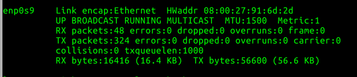

  - 设置后

    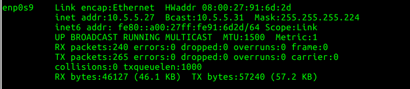

### 四、Samba

- windows服务器设置

  - 设置共享文件

  - 添加网络位置：https://www.techrepublic.com/article/how-to-connect-to-linux-samba-shares-from-windows-10/

  - 添加用户

    ```bash
    net user test test /add
    #cmd管理员权限
    ```

  - 修改共享文件权限 给test用户相关先去哪

- linux用户名密码访问windows共享文件

  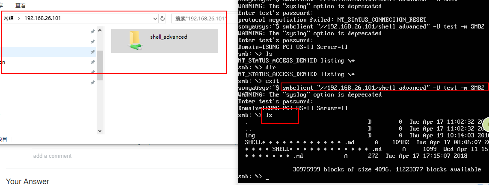

- linux匿名访问windows共享文件

  - 关闭密码保护

    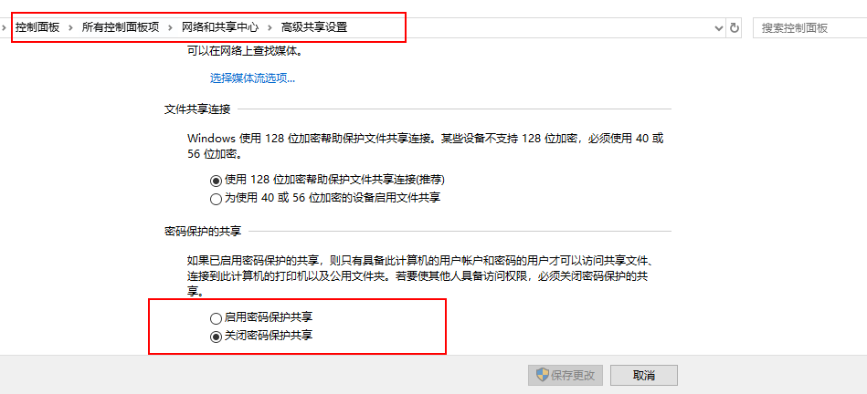

  - 匿名访问

    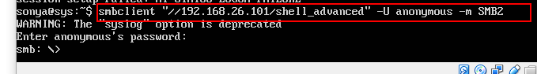

- 下载整个目录

  - 操作效果如图

  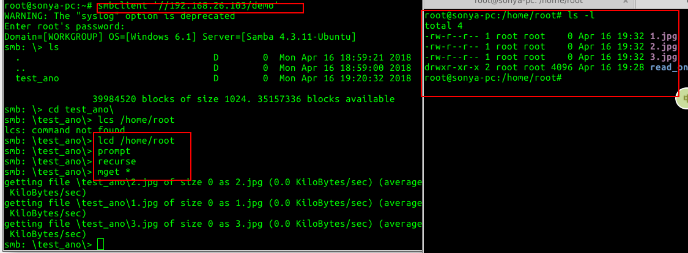

### 五、DNS

- 基于上述Internal网络模式连接的虚拟机实验环境，在DHCP服务器上配置DNS服务，使得另一台作为DNS客户端的主机可以通过该DNS服务器进行DNS查询

- 配置

  - 安装bind9

  - 配置/etc/bind/named.conf.local文件

    ```bash

    zone "cuc.edu.cn"{
            type master;
            file "/etc/bind/db.cuc.edu.cn";
    };
    ```

  - 配置/etc/bind/db.cuc.edu.cn文件

    ```bash
    $TTL    604800
    @       IN      SOA     cuc.edu.cn. root.cuc.edu.cn. (
                                  2         ; Serial
                             604800         ; Refresh
                              86400         ; Retry
                            2419200         ; Expire
                             604800 )       ; Negative Cache TTL

    @      IN      NS      localhost.
    @      IN      A       127.0.0.1
    @      IN      AAAA    ::1
    wp.sec.cuc.edu.cn.  IN       A      10.5.5.28
    ```

- 效果

  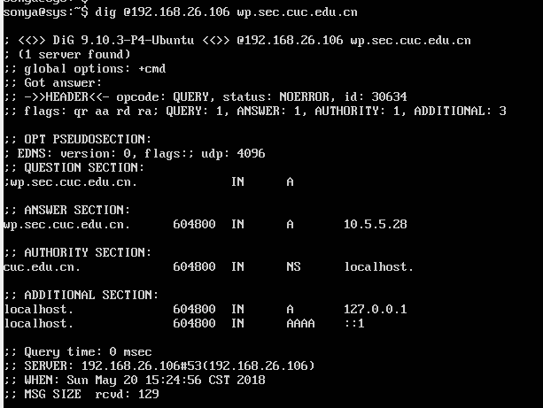


## 自动安装与自动配置

- 过程简述：

  - 验证环境
  - 普通用户 更改ssh配置文件 允许root用户登录
  - 添加root用户公钥
  - 安装软件
  - 配置文件

- 执行要求：

  - root用户权限执行

  - 安装sshpass

  - 文件结构说明

    ```bash
    # dhcp相关的网卡 网段配置没有用参数 因为参数太多了 认为直接配置文件 更容易理解
    conf
    ---- dhcpd.conf #dhcp相关需要手动配置
    ---- exports
    ---- host_name.db
    ---- isc-dhcp-server #dhcp相关需要配置手动
    ---- named.conf.local
    ---- proftpd.conf
    ---- tls.conf
    config_replace_string.sh
    config.sh
    expect_ftp_user.sh
    install.sh
    interface #dhcp相关
    root_ssh
    ssh_command.sh  #只需运行这一个文件即可
    ```

- 详见代码及注释(code文件夹)

- 存在的问题

  - 执行命令将输出内容用管道操作输出到grep进行匹配并且只输出匹配项 但是有时候会输出一些其他信息 多为警告 例：

    ```bash 
    sonya@sys:~/work_space/shell_advanced_cak$ lsb_release -a | grep -o "16.04.4"
    No LSB modules are available.  ## 我认为这句不应该输出
    16.04.4
    ```

    ​

  - [已解决]

    sed: -e expression #1, unknown option to `s'

    https://blog.csdn.net/qq1124794084/article/details/76419464

