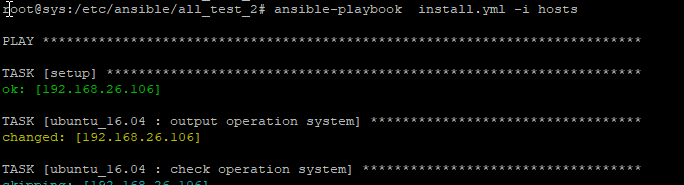
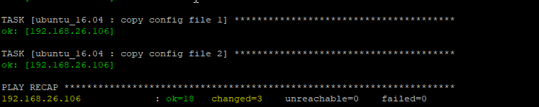

## 第七次作业 ansible

- 实验结果
  - 与第六次作业逻辑上没有大区别 只是将bash脚本翻译成了ansible脚本
  - 文件目录

```bash
.
├── hosts  #被配置主机
├── install.yml #主入口程序
└── roles
    └── ubuntu_16.04
        ├── files
        ├── handlers
        │   └── main.yml #重启
        ├── meta
        ├── tasks
        │   └── main.yml  #主要完成任务代码
        ├── templates
        │   ├── dhcpd.conf #dhcp相关 【自定义配置】 变量太多 直接填写比参数化更容易理解
        │   ├── expect_ftp_user.sh  #生成非匿名ftp用户expect脚本
        │   ├── exports
        │   ├── host_name.db 
        │   ├── interface  # dhcp添加的网卡 【自定义配置】
        │   ├── isc-dhcp-server #dhcp  【自定义配置】
        │   ├── named.conf.local
        │   └── proftpd.conf
        └── vars
            └── main.yml  #全局变量  【自定义配置】


```


- 运行

  	

  

- 注意事项

  - yaml文件的缩进